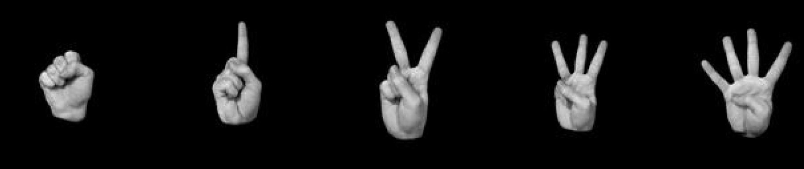
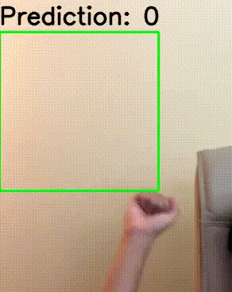

# Finger Counting with OpenCV
After implementing finger counting using edge detection and contours, I'll try using deep learning for this project. Afterward, I will compare the two methods.
The dataset: [🔗 View the Dataset on Kaggle](https://www.kaggle.com/datasets/koryakinp/fingers) 
The dataset contains 21,600 images of left and right hands, with finger counts from 0 to 5. All images are 128x128 pixels.
 

## Results with Basic CNN

As we can see, it's still not perfect, even though the model achieved an accuracy of over 96% and a loss of less than 1% on test images. But it's still better than traditional method that can't predict in dim lights, but with Deep Learning it's more achieveable.
## Problems🤔
🟥 The model may make incorrect predictions if the angle of the captured fingers differs from the dataset. 
🟥 The model will make incorrect predictions if the background is not blank. 
# How to tackle the problems:
🔲 Process the dataset to make it more like binary threshold images and train the model using that dataset. 
🔲 Try different model architectures or use a pretrained model with the ImageNet dataset, hoping that it can better differentiate between fingers and backgrounds. 
🔲 Add more images to the dataset by recording my own fingers and labeling them. 
🔲 Try different data augmentation techniques and find the best way to augment the dataset. 
